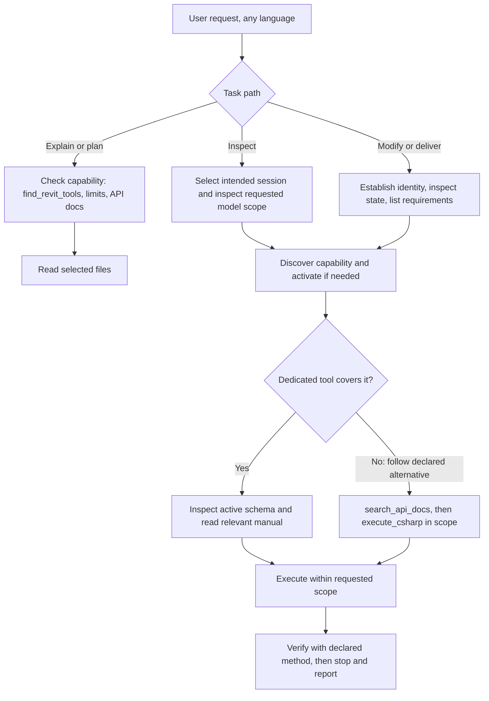

# PI-Revit guidance and tool architecture

This document defines the implemented structure and how to extend it. It replaces
one long operational skill with focused resources and explicit discovery. The five
responsibilities below are PI-Revit's design, not a requirement imposed by Pi and
not a demonstrated performance improvement. Contributor instructions live in
[root AGENTS.md](../AGENTS.md); runtime task guidance starts at
[the PI-Revit skill](../skills/pi-revit/SKILL.md).

## Resource scope and resource type

**Global versus project** describes where instructions/resources are discovered
and apply. **Instructions, skills, tools, templates and packages** describe what
they do. These are separate axes: a globally installed skill is not automatically
an always-loaded global instruction file.

Pi's context files provide persistent instructions in their applicable scope.
Skills expose task descriptions for selection; reading their body and supporting
files is a separate action. Prompt templates are reusable requests. Extensions
are Pi's standard mechanism for adding model-callable tools and runtime behavior;
skills can invoke helper scripts through existing tools. Packages distribute these
resources and do not define a new instruction priority or workflow engine.

The implementation was checked against Pi 0.87.0. See its versioned
[skills documentation](https://github.com/earendil-works/pi/blob/v0.87.0/packages/coding-agent/docs/skills.md),
[extension documentation](https://github.com/earendil-works/pi/blob/v0.87.0/packages/coding-agent/docs/extensions.md),
[package documentation](https://github.com/earendil-works/pi/blob/v0.87.0/packages/coding-agent/docs/packages.md),
and [context-file documentation](https://github.com/earendil-works/pi/blob/v0.87.0/packages/coding-agent/README.md).
Recheck supported Pi behavior when upgrading. The model may omit a relevant skill
or reference; critical enforcement therefore stays in executable code.

## Platform layer and five responsibilities

Problems are fixed as classes, at the lowest layer where every present and future
resource inherits the fix. Each fix combines a mechanism in code or declared metadata,
a CI gate that makes a non-compliant addition fail, and an agent-evaluation scenario:

```text
L5  Gates (npm run test:docs) and agent evaluation (tests/agent-eval)
L4  Guidance: one router skill, protocols stated once, manuals with generated contracts
L3  Shared bridge primitives: ParameterResolver, ElementTraits, InheritedState, ElementNames,
    ModelEditBatch, DocumentGuard; the dispatcher attaches model_changes to every write
L2  Resource contract v2: keywords, limits with alternatives, verification, effects
L1  Platform runtime in the Pi extension: acts on metadata, never on tool names
```

L1 therefore covers a tool that a future bridge advertises and this package has never
seen. A tool without declared metadata is treated conservatively: its limits are
"unknown", which leads to the API check rather than a refusal.

| Responsibility | Owner | Load/use when |
| --- | --- | --- |
| Cross-cutting protocols | The platform section injected by `platform-prompt.ts` through `before_agent_start`, always in context | Every request, whether or not the skill is read |
| Operating rules | Short `skills/pi-revit/SKILL.md`, shared execution/recovery/visual references | Task routing; model work; uncertainty; visible output respectively |
| Tool contracts | Runtime schemas and implementations, plus declared keywords, limits and verification; `references/tools/<name>.md` explains each, with a generated Contract block | A relevant tool is selected or explained |
| Revit knowledge | Future scoped subject skills and cited Autodesk Help references | A modeling concept or domain task needs explanation |
| Workflows | Room-documentation and model-audit/export references, indexed as guidance | Coordinating several operations into a requested outcome |
| API reference | `search_api_docs`, followed by inspection/compilation as appropriate | A custom script uses unfamiliar API members, or no dedicated tool covers a request |

The domain library is deliberately not filled with empty placeholders or copied
tool contracts. It can grow under `skills/revit-<subject>/` in this package, and
discovery finds any sibling skill automatically. A later `revit-skills` package is
optional when ownership/versioning warrant it, not required to make references work.

```text
pi-revit/                         repository and installable package
├── AGENTS.md                     source contributor instructions
├── docs/
│   ├── architecture.md           structure, ownership and extension rules
│   ├── evaluation.md             checks, evidence and remaining evaluation
│   └── invariants.json           every normative rule and its enforcement
├── extensions/pi-revit/
│   ├── index.ts                  Pi registration, bridge calls, result handling
│   ├── platform-prompt.ts        protocols stated once; shared-rule hoisting
│   ├── completion-monitor.ts     metadata-driven completion check
│   ├── scope-monitor.ts          per-request ledger; objects that predate the request
│   ├── contracts.ts              native contracts; contract hash
│   ├── discovery.ts              English-vocabulary search over all resources
│   ├── tool-catalog.ts           discover/activate tools; limits; fallback route
│   ├── tool-documentation.ts     allowlisted manual resolver; contract compatibility
│   ├── instance-router.ts        target-session and operation routing
│   ├── tool-schema.ts            public bridge input-schema composition
│   └── script-library.ts         local reusable scripts
├── src/Revit/
│   ├── ToolRegistry.cs           bridge inventory and metadata/schema projection
│   ├── BridgeServer.cs           HTTP contract and dispatch
│   ├── CommandQueue.cs           work on Revit's API thread
│   ├── OperationStore.cs         operation receipts and deduplicated retry state
│   └── Tools/                    implementations; ToolContract, ParameterResolver, ElementTraits,
│                                 InheritedState, ElementNames, ModelChanges
├── skills/pi-revit/
│   ├── SKILL.md                  short task entry; not an encyclopaedia
│   ├── tool-manifest.json        documentation index: summaries, groups, guidance
│   ├── contracts.generated.json  generated contract snapshot (offline discovery)
│   └── references/               shared rules, workflows, tool-index, tools/<name>.md
├── workspace/AGENTS.md            runtime workspace template; output conventions
├── scripts/                      install/build, generator and validation utilities
└── tests/                        behavioral, documentation, discovery and agent-eval checks
```

The manifest describes 36 tools today: 30 bridge tools and six Pi utilities. That is
an inventory, not a limit. `package.json` loads `./skills` and the extension entry.

## Discovery, activation and reading



`find_revit_tools` has two scopes:

- **`available` (default):** six native utilities plus the selected bridge's last
  discovered catalogue. If no catalogue is known, it attempts discovery. Query or
  exact names activate the returned page by default; plain browsing does not.
  Activation is additive and preserves other extensions' active tools.
- **`documentation`:** searches the packaged index and contract snapshot, enriched
  with known live descriptors. It makes no bridge request and does not activate tools.
  Explicit `activate: true` is rejected. An index entry does not imply executable support.

Search uses English tool vocabulary. There are no per-language rules: the platform
protocol tells the model to translate a request into English search words, reply in the
user's language, and read localized names from results. Matching normalizes case,
accents, plural and word forms, and ignores numbers, which are arguments. It scores the
name and keywords, the summary, declared limits and input names, and the live
description. All-word matches rank first, followed by strong partial matches. A
tool's declared limits are searchable, so a request just outside a tool finds that tool
together with its alternative. A zero or partial match returns the capability route (API
check, then custom execution) instead of an unexplained absence. Workflows, shared
references and every sibling skill are returned under `guidance`. Search quality is
gated by a corpus with a recall threshold.

Each result reports source, registration, selected-bridge advertisement, activation,
declared limits, verification method and a local documentation object.
`bridge_catalog_observed_at` dates the discovery snapshot. Neither `active` nor
`registered` is a health check. Use `ping` or instance management for connectivity;
`ping` also reports what is loaded: package, guidance revision, source revision and
per-tool contract agreement.

The resolver accepts known names from `tool-manifest.json`, constructs a local manual
path, verifies file accessibility and real-path containment, and reports missing
documentation nonfatally. It never trusts a bridge-provided filesystem path.

Compatibility is exact and per tool. The contract hash covers the input schema,
without descriptions, titles or examples, plus write/effects/document requirement:

- `contract_match`: the manual was generated from the selected bridge's exact contract.
- `contract_changed`: trust the active schema over the manual.
- `undocumented`: a newer bridge tool with no packaged manual.
- `unknown`: no live contract observed.
- `package_local`: a native utility.

Rewording guidance never flags a bridge. A changed type, requiredness, enum or effect always does.

Cross-cutting rules are stated once, in the platform section:

- capability resolution;
- scope and completion;
- evidence;
- identity;
- language;
- the manual location.

Bridge guidelines that repeat across tools are hoisted into that section generically,
by normalizing the tool name, so no per-tool copy returns even from older bridges. Per-tool
guidelines keep only tool-specific facts. Under Pi 0.87.0, snippets and guidelines
contribute for active tools. Specialist tools start inactive, and activation exposes
their schemas and guidance on subsequent model requests. No step automatically reads a
manual, and the skill may be skipped. That is why the protocols live in the always-present
section, and why critical enforcement stays in code.

Every call of a tool that can write or has model effects reports `model_changes`. The bridge
dispatcher records Revit's document-change events for the duration of the call and merges the net
added, modified and deleted objects into the result, with the visibility state of new views. Tools
need no code for it, and custom scripts are covered too. Objects made from an existing one also
report `inherited_state` through the shared `InheritedState` helper, and names and sheet numbers
go through `ElementNames`, which rejects a name already in use with the existing object's ID.
Architecture gates enforce all three for present and future tools.

The scope monitor reads those reports, never tool names. Per user request it keeps the objects
created in that request. When a call changes a pre-existing object whose name the request
mentions, or a creation hits a name collision, it appends a note that the object predates the
request, and the platform protocol requires asking the user or reporting it. It steers and never
blocks.

The completion monitor is metadata-driven. When an identical verification call repeats
after further model changes in one request, it appends a completion check, starting from
the third such check. The check asks the agent to verify the explicit requirements,
stop and report, and offer further improvements as suggestions. It steers and never
blocks, so legitimate multi-step work continues. A call's `model_changes`
decide whether it changed the model; declared write/effects are the fallback for older bridges.

## Contract ownership and enforcement

For a bridge tool, the final public input schema is composed in this order:

1. Tool class `ParametersSchema` supplies operation inputs.
2. `ToolRegistry.DescribeParameters` adds document identity and requiredness.
3. `publicBridgeSchema` adds extension `_operation_id` retry metadata.

Pi-native tools register their own TypeBox schemas, and their v2 metadata lives in
`contracts.ts`. Code owns every executable contract. `npm run generate:contracts`
snapshots it into `contracts.generated.json`, each manual's Contract block and the
tool index, and the gate fails when any of them is stale. Manuals explain these final
contracts, including action-dependent runtime checks that JSON Schema may not express.
The hand-written manifest holds only summaries, groups and guidance entries.
Current code/registered schemas govern accepted inputs; actual returned outcomes
govern claims about success. Documentation is not an enforcement boundary. Every
normative rule is registered in `docs/invariants.json` with its enforcement: code
with a named test, or, only for agent intent that code cannot observe, advisory with
the agent-eval scenario that measures it. Shared primitives own cross-cutting policy.
`ParameterResolver` never silently chooses among same-named parameters.
`ElementTraits` flags system-owned objects such as titleblock revision schedules.
Architecture gates stop a tool from reintroducing a private variant.
<!-- inv:manual-path-containment -->

Exact-document guards, supported transaction/preview behavior, original-session
receipt routing and tool-specific limits remain enforced by their existing code.
An explanation does not authorize a write; an audit does not authorize repair;
an edit does not imply file saving. Workflows inherit the user's scope, branch
accordingly, and use recovery/visual checks when relevant. No universal extra
confirmation step is introduced.

API search reads the selected Revit installation's available XML documentation
and supports enum reflection. It requires the bridge but no open document. It is
not a complete compile check or permission to run arbitrary scripts. General
Revit domain knowledge and current API signatures have different owners; storing
a copied API encyclopaedia in `SKILL.md` would duplicate and age those contracts.

## Content ownership and migration

The former long entry is redistributed as follows:

| Former material | Maintained home |
| --- | --- |
| Task routing and concise essential cautions | `SKILL.md` |
| Instance/document targeting, parameters, units, partial success | `execution-rules.md` and relevant tool manuals |
| Receipts, retries, timeout/bridge/no-document failures | `operation-recovery.md`, `get_revit_operation.md`, `ping.md` |
| Visual evidence and export verification | `visual-verification.md`, capture/export manuals |
| Per-tool inputs, outputs, limits and action differences | Matching tool manual |
| C# globals, transactions, results and reusable scripts | `execute_csharp.md`, `manage_revit_scripts.md`, `search_api_docs.md` |
| Room and audit sequences | Existing workflow references, now with explain/inspect/modify paths |
| Upgrade/deployment notes | README installation/upgrade section and CHANGELOG |
| Model output-folder conventions | `workspace/AGENTS.md` template |

The workspace template is copied only when absent; setup preserves a user's existing
file. When template guidance changes, describe the manual merge in upgrade notes.
Do not overwrite existing workspace conventions or place contributor rules there.

For new domain content, pick a useful subject/task boundary, cite the relevant
official Autodesk Help pages and version, and separate concepts from step-by-step
recipes. Give the entry skill a selective description and a short map to its
references. Keep tool inputs in their existing manuals. Validate routing on both
positive examples and nearby requests that should not load the subject skill.

New tools, changed contracts and documentation checks follow [AGENTS.md](../AGENTS.md).
Guidance revisions are tracked independently from release versions. This structure
is implemented on the branch; comparative agent effectiveness and latency remain
evaluation work described in [evaluation.md](evaluation.md).
